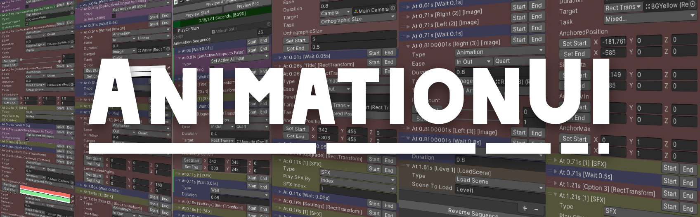
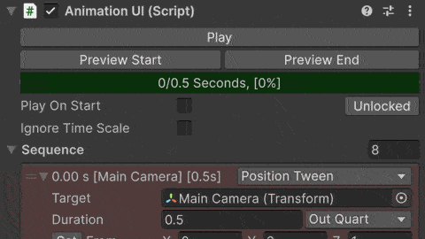
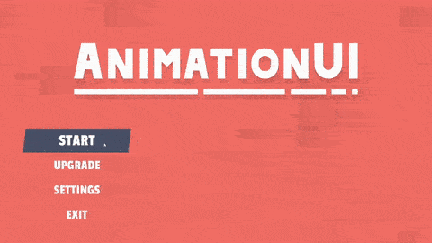

<h1 align="center">AnimationUI v2.0</h1>

AnimationUI is a powerful Unity tool to create complex animations or tweens with no code and extendable with code. Simply drag and drop components to automatically generate tweens, or manually configure custom animation sequences. Built from the ground up for v2.0, it features intelligent component detection, enhanced editor integration, and a streamlined step-based architecture.

Perfect for UI animations, camera movements, audio transitions, and more - all with real-time preview in edit mode.


## 🕹️ Demo Preview

<p align="center" width="100%">
     
     
</p>
<p align="center" width="100%">
     
     
</p>


## ✨ Features

### Core Features
- **Automatic Tween Detection** - Drag any supported component and AnimationUI automatically creates the appropriate tween
- **Step-Based Sequencing** - Build complex animations with a flexible sequence of steps
- **Real-time Edit Mode Preview** - See your animations play in edit mode with precise timeline scrubbing
- **State Management** - Full control with Play, Pause, Resume, Stop, and StopAndPlay
- **Time Control** - Jump to any point in your animation or apply states at specific times
- **Reverse Sequences** - Instantly reverse your entire animation for transitions

### Supported Tween Types
AnimationUI v2.0 includes **40+ built-in tween types** across multiple categories:

#### UI Components
- **CanvasGroup**: `AlphaTween`
- **Image**: `ImageColorTween`, `ImageFillTween`, `ImageFlipbookTween`
- **RectTransform**: `AnchoredPositionTween`, `AnchorMinTween`, `AnchorMaxTween`, `PivotTween`, `SizeDeltaTween`, `RTLocalScaleTween`, `RTLocalEulerAnglesTween`
- **TMP_Text**: `TextRevealTween`, `TextGlitchRevealTween`, `TextColorTween`, `CountdownTween`

#### Transform & Physics
- **Transform (Position)**: `PositionTween`, `LocalPositionTween`, `PositionToTween`, `PositionToRtTween`
- **Transform (Rotation)**: `RotationTween`, `LocalRotationTween`, `EulerAnglesTween`, `LocalEulerAnglesTween`, `RotationToTween`
- **Transform (Scale)**: `LocalScaleTween`, `SquishTween`
- **Transform (Special)**: `UpTween`, `RightTween`, `SineShakeTween`, `SineShakeLocalTween`, `ThrownTween`, `ThrownLocalTween`

#### Rendering
- **Camera**: `OrthographicSizeTween`
- **SpriteRenderer**: `SpriteColorTween`, `SpriteFlipbookTween`
- **Material**: `MaterialColorTween`, `MaterialFloatTween`
- **MeshFilter**: `VertexColorTween`

#### Audio
- **AudioSource**: `VolumeTween`
- **AudioMixer**: `MixerTween`

#### Utility Steps
- **Wait** - Adds delays between tweens
- **SFX** - Plays audio clips
- **Event** - Invokes UnityEvents
- **SetActive** - Toggles GameObject activation
- **LoadScene** - Loads scenes
- **SetTargetAsFrom** - Captures target values at runtime
- **Automatic** - Smart component detection for auto-tween creation

### Advanced Features
- **40+ Built-in Tweens** - Comprehensive tween library covering UI, transforms, rendering, and audio
- **Easing Functions** - 45+ easing types (Linear, Sine, Quad, Cubic, Quart, Quint, Expo, Circ, Elastic, Back, Bounce - all with In/Out/InOut variants)
- **Special Transform Tweens** - Squish, Shake, Thrown, directional movements (Up, Right), and more
- **Flipbook Animations** - Sprite and Image flipbook tweens for frame-based animations
- **Play on Start** - Automatically play animations when scenes load with `PlayOnStart`
- **Ignore Time Scale** - Perfect for pause-menu animations that need to work during `Time.timeScale = 0`
- **Value Capturing** - Quickly capture current component values as From/To states
- **Custom Steps** - Extensible architecture through interfaces (`ITweenable`, `IWaitable`, `IExecutable`, `IInjectable`, `IReverseSequenceHandler`)
- **Progress Tracking** - Individual progress indicators for each step in the inspector
- **Anonymous Tweens** - Create custom tweens programmatically without defining new classes


## 📘 Quick Start

### Basic Setup
1. **Add the Component**
   - Right-click in Hierarchy → UI → Create AnimationUI, or
   - Add the `AnimationUI` component to any GameObject

2. **Add Steps**
   - Click the `+` button to add a new step
   - For automatic tweens, drag a supported component (e.g., CanvasGroup, Image, Transform)
   - AnimationUI will automatically detect and create the appropriate tween type

3. **Configure Your Animation**
   - Set From/To values for each tween
   - Adjust duration, easing curves, and delays
   - Add wait steps to control timing between tweens

4. **Preview & Test**
   - Drag the progress slider to scrub through your animation
   - Click **Play** in edit mode to preview (ensure Scene View is open)
   - Toggle `Play On Start` to auto-play when the scene loads

### Capturing Values
- **Set From Button** - Captures the current state as the starting value
- **Set To Button** - Captures the current state as the ending value
- Or manually input values in the inspector

### Animation Control
```csharp
// In your script
public AnimationUI animationUI;

void Start()
{
    animationUI.Play();           // Start animation
    animationUI.Pause();          // Pause animation
    animationUI.Resume();         // Resume from pause
    animationUI.Stop();           // Stop and reset
    animationUI.StopAndPlay();    // Stop then immediately play
}
```


## 🎯 Advanced Usage

### Reversing Animations
Perfect for menu transitions - reverse your entire sequence with one call:
```csharp
animationUI.ReverseSequence();
animationUI.Play();
```

### Jump to Specific Times
```csharp
// Jump to start
animationUI.ApplyToStart();

// Jump to end
animationUI.ApplyToFinish();

// Jump to specific time
animationUI.ApplyAllAtTime(2.5f);
```

### Setting Target Values
Quickly set up tweens by capturing the current component state:
```csharp
// Set all tween FROM values to current target values
animationUI.SetAllTweenTargetValueAsFrom();

// Set all tween TO values to current target values
animationUI.SetAllTweenTargetValueAsTo();

// Or for a specific step
animationUI.SetTweenTargetValueAsFrom(stepIndex);
animationUI.SetTweenTargetValueAsTo(stepIndex);
```

### Accessing Steps
```csharp
// Get a specific step
var step = animationUI.Get<AlphaTween>(0);

// Add steps programmatically
animationUI.Add(new AlphaTween());

// Access the full sequence
List<Step> sequence = animationUI.Sequence;
```

### State Checking
```csharp
if (animationUI.IsPlaying)
{
    // Animation is currently playing
}

if (animationUI.IsPaused)
{
    // Animation is paused
}

if (animationUI.IsNotPlaying)
{
    // Animation is stopped or hasn't started
}

// Get current animation time
float currentTime = animationUI.CurrentAnimationTime;

// Calculate total duration
float totalDuration = animationUI.CalculateTotalDuration();
```

### Creating Anonymous Tweens
For one-off custom tweens without creating new classes:
```csharp
using DhafinFawwaz.AnimationUI;
using UnityEngine;

public class CustomTweenExample : MonoBehaviour
{
    [SerializeField] AnimationUI animation;
    [SerializeField] Light myLight;
    
    void Start()
    {
        // Create a custom tween for light intensity
        var lightTween = new AnonymousTween<Light, float, float, float>(
            component: myLight,
            InterpolationFunction: (from, to, t) => Mathf.Lerp(from, to, t),
            ApplyInterpolation: (value) => myLight.intensity = value,
            from: 0f,
            to: 5f,
            duration: 2f,
            easeType: Ease.OutQuad
        );
        
        animation.Add(lightTween);
        animation.Play();
    }
}
```


## 🔍 API Reference

### Namespace
```csharp
using DhafinFawwaz.AnimationUI;
```

### Core Methods

| Method | Description |
|:-------|:------------|
| `Play()` | Starts the animation from the beginning |
| `Pause()` | Pauses the animation at the current time |
| `Resume()` | Resumes the animation from where it was paused |
| `Stop()` | Stops the animation and resets to time 0 |
| `StopAndPlay()` | Stops the current animation and immediately starts it again |
| `ReverseSequence()` | Reverses the entire sequence order (great for back transitions) |
| `ApplyToStart()` | Instantly applies all steps to their starting state |
| `ApplyToFinish()` | Instantly applies all steps to their ending state |
| `ApplyAllAtTime(float t)` | Applies all steps to their state at time `t` |
| `CalculateTotalDuration()` | Returns the total duration of the animation sequence |

### Value Management Methods

| Method | Description |
|:-------|:------------|
| `SetAllTweenTargetValueAsFrom()` | Sets all tween FROM values to their current target values |
| `SetAllTweenTargetValueAsTo()` | Sets all tween TO values to their current target values |
| `SetTweenTargetValueAsFrom(int index)` | Sets a specific tween's FROM value to its current target value |
| `SetTweenTargetValueAsTo(int index)` | Sets a specific tween's TO value to its current target value |

### Step Management Methods

| Method | Description |
|:-------|:------------|
| `Add(Step step)` | Adds a new step to the sequence |
| `Get<T>(int idx)` | Gets a step at the specified index as type T |
| `Sequence` | Property to access the full List<Step> |

### Properties

| Property | Type | Description |
|:---------|:-----|:------------|
| `IsPlaying` | `bool` | True if the animation is currently playing |
| `IsPaused` | `bool` | True if the animation is paused |
| `IsNotPlaying` | `bool` | True if the animation is not playing (stopped or never started) |
| `State` | `AnimationUIState` | Current state enum (IsPlaying, IsPaused, IsNotPlaying) |
| `CurrentAnimationTime` | `float` | Current time position in the animation |
| `PlayOnStart` | `bool` | If true, plays automatically on Start() |
| `IgnoreTimeScale` | `bool` | If true, uses unscaled time (useful for pause menus) |
| `Sequence` | `List<Step>` | The list of all animation steps |


## 📚 Examples

### Basic Animation Control
```csharp
using DhafinFawwaz.AnimationUI;
using UnityEngine;

public class MenuController : MonoBehaviour
{
    [SerializeField] AnimationUI openAnimation;
    [SerializeField] AnimationUI closeAnimation;
    
    public void OpenMenu()
    {
        openAnimation.Play();
    }
    
    public void CloseMenu()
    {
        closeAnimation.Play();
    }
}
```

### Reversible Menu Transitions
```csharp
using DhafinFawwaz.AnimationUI;
using UnityEngine;

public class SettingsMenu : MonoBehaviour
{
    [SerializeField] AnimationUI menuAnimation;
    bool isOpen = false;
    
    public void ToggleMenu()
    {
        if (isOpen)
        {
            menuAnimation.ReverseSequence();
        }
        menuAnimation.Play();
        isOpen = !isOpen;
    }
}
```

### Timeline Control
```csharp
using DhafinFawwaz.AnimationUI;
using UnityEngine;

public class AnimationScrubber : MonoBehaviour
{
    [SerializeField] AnimationUI animation;
    [SerializeField] UnityEngine.UI.Slider timelineSlider;
    
    void Start()
    {
        float duration = animation.CalculateTotalDuration();
        timelineSlider.maxValue = duration;
        timelineSlider.onValueChanged.AddListener(OnTimelineChanged);
    }
    
    void OnTimelineChanged(float time)
    {
        animation.ApplyAllAtTime(time);
    }
    
    public void JumpToEnd()
    {
        animation.ApplyToFinish();
    }
}
```

### State-Based Logic
```csharp
using DhafinFawwaz.AnimationUI;
using UnityEngine;

public class LoadingScreen : MonoBehaviour
{
    [SerializeField] AnimationUI loadingAnimation;
    
    void Update()
    {
        if (loadingAnimation.IsPlaying)
        {
            // Disable user input while loading animation plays
            BlockUserInput();
        }
        else if (loadingAnimation.IsNotPlaying)
        {
            // Re-enable input when animation completes
            EnableUserInput();
        }
    }
}
```

### Dynamic Step Modification
```csharp
using DhafinFawwaz.AnimationUI;
using UnityEngine;

public class DynamicAnimation : MonoBehaviour
{
    [SerializeField] AnimationUI animation;
    
    void Start()
    {
        // Access and modify a specific step
        var alphaTween = animation.Get<AlphaTween>(0);
        if (alphaTween != null)
        {
            // Modify tween properties at runtime
            // (Assuming AlphaTween has public properties for duration, ease, etc.)
        }
        
        // Get the full sequence
        var allSteps = animation.Sequence;
        Debug.Log($"Animation has {allSteps.Count} steps");
    }
}
```

### Quick Setup Helper
```csharp
using DhafinFawwaz.AnimationUI;
using UnityEngine;

public class AnimationSetupHelper : MonoBehaviour
{
    [SerializeField] AnimationUI animation;
    
    [ContextMenu("Capture All From Values")]
    void CaptureFromValues()
    {
        animation.SetAllTweenTargetValueAsFrom();
        Debug.Log("Captured all FROM values from current state");
    }
    
    [ContextMenu("Capture All To Values")]
    void CaptureToValues()
    {
        animation.SetAllTweenTargetValueAsTo();
        Debug.Log("Captured all TO values from current state");
    }
}
```


## 💡 Tips & Best Practices

### Inspector Workflow
- **Lock the Inspector** - Makes it easier to modify component values while setting up tweens
- **Use Progress Indicators** - Each step shows individual progress on the left side
- **Duplicate Similar Steps** - Unity's list duplication copies the previous item, speeding up similar animations

### Performance
- Use `IgnoreTimeScale` for UI that should animate during pause (like pause menus)
- Consider using `PlayOnStart` for scene transition animations
- The system automatically prevents multiple updates per frame

### Edit Mode Preview
- Ensure the Scene View is open when previewing in edit mode for smooth playback
- Use the global progress bar to scrub through the entire animation
- Each step has its own progress indicator for fine-tuned control

### Animation Architecture
- Keep related animations on separate AnimationUI components for modularity
- Use `ReverseSequence()` instead of creating duplicate "close" animations
- Combine `ApplyToStart()` or `ApplyToFinish()` with instant setup needs


## 🔧 Extending AnimationUI

### Creating Custom Tween Types

To create a new tween, inherit from the `Tween<TComponent, UFrom, VTo, WInterpolationOutput>` base class. Understanding the generic parameters is crucial:

#### Generic Parameters Explained

```csharp
public class MyTween : Tween<TComponent, UFrom, VTo, WInterpolationOutput>
```

| Generic | Purpose | Example |
|:--------|:--------|:--------|
| `TComponent` | The Unity component you're tweening | `Transform`, `Image`, `Light`, `AudioSource` |
| `UFrom` | Type of the **From** value | `float`, `Vector3`, `Color`, `int` |
| `VTo` | Type of the **To** value (usually same as UFrom) | `float`, `Vector3`, `Color`, `int` |
| `WInterpolationOutput` | Return type of your interpolation function | Usually same as `UFrom`, but can differ (e.g., `float` → `Quaternion`) |

**Why separate UFrom and VTo?** This allows flexibility for special cases like `PositionToTween` where From is `Vector3` but To is a `Transform` reference.

#### Step-by-Step: Creating a Custom Tween

Let's create a custom tween to animate a Light's intensity:

```csharp
using DhafinFawwaz.AnimationUI;
using UnityEngine;
using System;

[Serializable]
public class LightIntensityTween : Tween<Light, float, float, float>
{
    // 1. Define the interpolation function
    //    Parameters: (UFrom, VTo, float t) where t is 0-1
    //    Returns: WInterpolationOutput
    protected override Func<float, float, float, float> InterpolationFunction 
        => (from, to, t) => Mathf.Lerp(from, to, t);
    
    // 2. Apply the interpolated value to your component
    public override void ApplyInterpolation(float value)
    {
        Target.intensity = value;
    }
    
    // 3. Capture current value as From (for "Set From" button)
    public override void SetFromAsTargetValue()
    {
        From = Target.intensity;
    }
    
    // 4. Capture current value as To (for "Set To" button)
    public override void SetToAsTargetValue()
    {
        To = Target.intensity;
    }
}
```

#### More Examples

**Vector3 Tween (Position, Scale, etc.)**
```csharp
[Serializable]
public class CustomPositionTween : Tween<Transform, Vector3, Vector3, Vector3>
{
    protected override Func<Vector3, Vector3, float, Vector3> InterpolationFunction 
        => Vector3.Lerp;
    
    public override void ApplyInterpolation(Vector3 value)
    {
        Target.position = value;
    }
    
    public override void SetFromAsTargetValue() => From = Target.position;
    public override void SetToAsTargetValue() => To = Target.position;
}
```

**Color Tween**
```csharp
[Serializable]
public class LightColorTween : Tween<Light, Color, Color, Color>
{
    protected override Func<Color, Color, float, Color> InterpolationFunction 
        => Color.Lerp;
    
    public override void ApplyInterpolation(Color value)
    {
        Target.color = value;
    }
    
    public override void SetFromAsTargetValue() => From = Target.color;
    public override void SetToAsTargetValue() => To = Target.color;
}
```

**Advanced: Different From/To Types**
```csharp
// From is a Vector3, To is a Transform (tween towards another object)
[Serializable]
public class MoveTowardsTransformTween : Tween<Transform, Vector3, Transform, Vector3>
{
    protected override Func<Vector3, Transform, float, Vector3> InterpolationFunction 
        => (from, to, t) => Vector3.Lerp(from, to.position, t);
    
    public override void ApplyInterpolation(Vector3 value)
    {
        Target.position = value;
    }
    
    public override void SetFromAsTargetValue() => From = Target.position;
    public override void SetToAsTargetValue() 
    {
        // To is a Transform, so we don't set it from Target
        // User assigns this manually in inspector
    }
}
```

**Advanced: Output Type Different from Input**
```csharp
// Interpolate euler angles (Vector3) but output Quaternion
[Serializable]
public class CustomRotationTween : Tween<Transform, Vector3, Vector3, Quaternion>
{
    protected override Func<Vector3, Vector3, float, Quaternion> InterpolationFunction 
        => (from, to, t) => Quaternion.Euler(Vector3.Lerp(from, to, t));
    
    public override void ApplyInterpolation(Quaternion value)
    {
        Target.rotation = value;
    }
    
    public override void SetFromAsTargetValue() => From = Target.eulerAngles;
    public override void SetToAsTargetValue() => To = Target.eulerAngles;
}
```

#### Quick Reference Checklist

When creating a custom tween, you must:
- ✅ Choose correct generics: `Tween<TComponent, UFrom, VTo, WInterpolationOutput>`
- ✅ Override `InterpolationFunction` property (returns a Func)
- ✅ Override `ApplyInterpolation(WInterpolationOutput value)` method
- ✅ Override `SetFromAsTargetValue()` method
- ✅ Override `SetToAsTargetValue()` method
- ✅ Add `[Serializable]` attribute to your class

Optional:
- Add `[BGColor("#RRGGBBAA")]` attribute for custom inspector color
- Override `GetDisplayName()` for custom inspector label
- Override `OnTargetAssigned()` for initialization when target is set

### Custom Step Types
Create custom steps by implementing the appropriate interfaces:

#### ITweenable Interface
For animated values that change over time:
```csharp
using DhafinFawwaz.AnimationUI;
using UnityEngine;
using System;

[Serializable]
public class MyCustomTween : Tween<MyComponent, float, float, float>
{
    protected override Func<float, float, float, float> InterpolationFunction => Mathf.Lerp;
    
    public override void ApplyInterpolation(float value)
    {
        Target.myValue = value;
    }
    
    public override void SetFromAsTargetValue()
    {
        From = Target.myValue;
    }
    
    public override void SetToAsTargetValue()
    {
        To = Target.myValue;
    }
}
```

#### IWaitable Interface
For steps that introduce delays:
```csharp
using DhafinFawwaz.AnimationUI;
using System;

[Serializable]
public class CustomWait : Step, IWaitable
{
    public float Duration = 1.0f;
    
    public float GetDuration()
    {
        return Duration;
    }
}
```

#### IExecutable Interface  
For instant actions that can be executed and reversed:
```csharp
using DhafinFawwaz.AnimationUI;
using UnityEngine;
using System;

[Serializable]
public class CustomAction : Step, IExecutable
{
    public GameObject Target;
    
    public void Execute()
    {
        // Do something
        Debug.Log("Action executed!");
    }
    
    public void Dexecute()
    {
        // Undo/reverse the action
        Debug.Log("Action reversed!");
    }
}
```

#### IReverseSequenceHandler Interface
For steps that need special behavior when sequence is reversed:
```csharp
using DhafinFawwaz.AnimationUI;
using System;

[Serializable]
public class ReversibleStep : Step, IReverseSequenceHandler
{
    public void OnSequenceReversed()
    {
        // Handle sequence reversal
        // Typically swap From and To values
    }
}
```

#### IInjectable Interface
For steps that need reference to the AnimationUI component:
```csharp
using DhafinFawwaz.AnimationUI;
using System;

[Serializable]
public class InjectableStep : Step, IInjectable
{
    AnimationUI _animationUI;
    
    public void Inject(object injected)
    {
        if (injected is AnimationUI aui)
        {
            _animationUI = aui;
            // Now you can access _animationUI.Sequence, etc.
        }
    }
}
```

### Interface Summary

| Interface | Purpose | Key Methods |
|:----------|:--------|:------------|
| `ITweenable` | Animated values over time | `Update(float time)`, `GetDuration()`, `SetTarget()` |
| `IWaitable` | Introduce delays/pauses | `GetDuration()` |
| `IExecutable` | Instant actions | `Execute()`, `Dexecute()` |
| `IInjectable` | Needs AnimationUI reference | `Inject(object injected)` |
| `IReverseSequenceHandler` | Custom reverse behavior | `OnSequenceReversed()` |


## 📃 Notes

- **v2.0 Breaking Changes**: Complete rewrite from v1.x. The API and architecture have changed significantly.
- **Namespace Change**: Now uses `DhafinFawwaz.AnimationUI` (was `DhafinFawwaz.AnimationUILib`)
- **Step-based Architecture**: Replaced the old sequence system with a more flexible Step-based approach
- **Automatic Detection**: Drag components directly - AnimationUI auto-creates the right tween type
- **State Management**: New state system with IsPlaying, IsPaused, and IsNotPlaying
- **Timeline Control**: New methods for precise animation control at any time point

### Migration from v1.x
The v2.0 rewrite introduces breaking changes. Key differences:
- Old `PlayReversed()` → Use `ReverseSequence()` then `Play()`
- Old `AddFunctionAt()` → Use custom executable steps
- Old `OnAnimationEnded` → Implement using state checking or custom executable steps
- Old static events removed → Implement custom executable steps as needed


## 📝 License
[MIT](https://choosealicense.com/licenses/mit/)